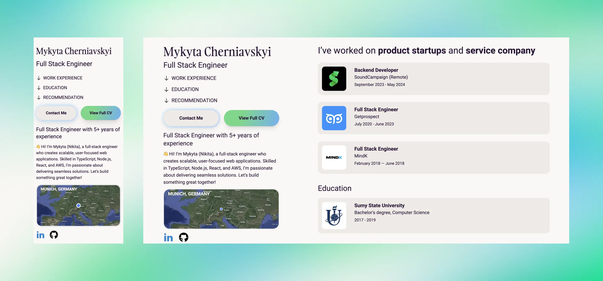

<h2 align="center">
  
🚀 Personal website built with Astro 4.0 🚀

  <a href="https://www.cherniavskyi.dev/" target="_blank">www.cherniavskyi.dev</a>
</h2>

  
  

Code is licensed under MIT, words and images are licensed under <a href='https://creativecommons.org/licenses/by-nc-sa/4.0/'>CC BY-NC-SA 4.0</a>.

## ✨ Commands

All commands are run from the root of the project, from a terminal:

| Command                   | Action                                           |
| :------------------------ | :----------------------------------------------- |
| `npm install`             | Installs dependencies                            |
| `npm run dev`             | Starts local dev server at `localhost:4321`      |
| `npm run build`           | Build your production site to `./dist/`          |
| `npm run preview`         | Preview your build locally, before deploying     |
| `npm run astro ...`       | Run CLI commands like `astro add`, `astro check` |
| `npm run astro -- --help` | Get help using the Astro CLI                     |
